# AI Code Reviewer

A Python 3.12 Docker service implementing the [implementation PRD](docs/implementation-prd.md).
It reviews GitLab merge requests through a deterministic state machine; models
produce schema-validated findings, never workflow or approval decisions.
Launch languages are **TypeScript, Go and Python**. Jira stories link to their
epics through a discovered Epic Link field or a parent-based hierarchy.
The service never commits, pushes, force-pushes, approves, or merges code.

## Start the project

```sh
# Only if .env does not already exist:
cp .env.example .env
# Edit .env and config/projects.json, then:
docker compose config --quiet
docker compose up -d --build
docker compose ps
```

The API is at **http://127.0.0.1:8092/docs**. PostgreSQL, Redis, API and worker
should be healthy; the one-shot `migrate` service should exit successfully.
The API, worker and migration use the same `ai-code-reviewer:local` image.
Image digests and Python packages are pinned. Containers run as UID 10001 with
read-only root filesystems and persistent repository/audit volumes.
Only the API publishes a port, bound to localhost.

A local `.env` already created during implementation contains generated local
PostgreSQL and admin credentials. No live GitLab, Jira, Confluence or gateway
credentials have been configured. Project admission defaults to an empty list.
Keep all credentials in `.env`; it is excluded from Git and image builds.

Required deployment settings:

| Setting | Purpose |
|---|---|
| `GITLAB_BASE_URL`, `GITLAB_TOKEN` | Internal forge URL and publication API token |
| `GIT_READ_TOKEN` | Separate read-only repository access token |
| `PROJECT_IDS` | JSON array of numeric GitLab project IDs to onboard, e.g. `[123,456]` |
| `WEBHOOK_SECRETS` | Optional JSON object mapping project IDs to distinct webhook secrets; these IDs are also onboarded for compatibility |
| `JIRA_BASE_URL`, `JIRA_TOKEN` | Jira Data Center REST v2, PAT authentication |
| `CONFLUENCE_BASE_URL`, `CONFLUENCE_TOKEN` | Confluence Data Center REST content API, PAT |
| `GATEWAY_BASE_URL`, `GATEWAY_KEY` | Internal OpenAI-compatible gateway, including `/v1` if applicable |
| `MODEL_STRONG`, `MODEL_FAST`, `MODEL_VERIFIER` | Approved gateway model IDs |
| `MODEL_CONTEXT_TOKENS` | Approved context-window limit |
| `ADMIN_TOKEN` | Bearer token for admin and metrics endpoints |

Confluence's REST content endpoint must be available on your installation.
Model availability and context limits must be confirmed before connecting real
projects. No provider SDK or public-provider fallback is used for LLM calls.

## Project policy

`config/projects.json` merges organization defaults with per-project overrides:

```json
{
  "defaults": {
    "enforcement": "advisory",
    "languages": ["typescript", "go", "python"],
    "issue_tracker": {"project_keys": ["PAY"], "ac_heading": "Acceptance Criteria"}
  },
  "projects": {
    "42": {"review": {"max_inline": 10, "max_per_file": 3}}
  }
}
```

A repository `.ai-review.yml` is read from the merge base, not the proposed
branch. It can override review, issue-tracker, document and language options;
operator-only enforcement, executable commands, model endpoints and credentials
cannot be selected by repository content.

Operator-only scheduling controls also live in project defaults or overrides:
`unit_concurrency` defaults to 2 workers per analysis stage (at most 8 active
units across the four stages per review). Set it to 1 for sequential units.
Purpose and Design remain sequential gates; System Context follows aggregation.
Size concurrency for gateway capacity and the number of concurrent reviews.

`final_stage_token_reserve` defaults to 0. Set an explicit token allowance to
protect System Context and independent verification from earlier stages. It
must be smaller than `review.token_ceiling` and is shared by those final stages;
it does not increase the total budget or guarantee complete coverage. Allow
for conservative prompt-byte plus maximum-output reservations when sizing it.
Calls wait for temporary reservations to settle, bounded by the review deadline.
True exhaustion still produces a partial, fail-open review.

Requested code is cached only within one SHA-pinned review, after a successful
secret scan, and repeated context is included once in each unit's prompt.
The authenticated event stream records `llm_attempt` metadata: normalized finish
reason, validation/transport failure category, and retry numbers. These events
contain no response text, validation input, or upstream error messages; the
existing private per-call audit records remain available separately.

`MILESTONE=M9` enables the complete pipeline. M0 remains an infrastructure-only
check; intermediate milestone values support staged rollout. Lower milestones
cannot issue a blocking decision from an incomplete review.

Enforcement modes:

- `silent`: retain review records; publish no comments; status always passes.
- `advisory`: publish comments; status always passes.
- `gating`: publish comments; a complete review with confirmed blocking findings
  or failed required static checks sets a failed commit status.

`blocking` is rejected by the configuration schema. A partial or failed review
passes in every mode. A passing status cannot be delivered while GitLab is
unreachable; undelivered status records remain durable for recovery.

## Review flow

```mermaid
flowchart LR
  Hook[Authenticated webhook] --> Queue[Redis / arq]
  Queue --> Context[SHA-pinned Git + Jira + Confluence]
  Context --> Secrets[Secret scan and redaction]
  Secrets --> Static[Sandboxed static checks]
  Static --> Purpose[Purpose gate]
  Purpose --> Design[Design gate]
  Design --> Fan[Correctness / Complexity / Test / Line review]
  Fan --> System[System context]
  System --> Validate[Evidence validation and verification]
  Validate --> Policy[Severity, deduplication, noise caps]
  Policy --> Publish[Comments and deterministic status]
```



Git uses disposable worktrees and local three-dot diffs with code-computed line
anchors. Hooks and filters are disabled. Repository content is never executed
by GitService. A changed head or inconsistent diff inventory supersedes the run.
Gitleaks scans before prompt creation, and matches produce deterministic secret
findings without a model call. Prompt and response persistence is redacted.

Purpose and Design run sequentially; a validated, confirmed blocker terminates
those gates. Four analysis stages fan out concurrently. Coverage is checked
against dispatched unit IDs; each missing unit gets one retry. Truncated or
failed stages mark the review partial. A verifier sees the claim, code and cited
evidence, excluding the proposer's severity, confidence and rationale.

Finding severities are `BLOCKER`, `REQUIRED`, `SUGGESTION`, `NIT`, `QUESTION`,
`FYI`, and `PRAISE`, assigned by deterministic category policy and caps.
At most 15 inline comments and five per file are permitted. Lower-severity and
unpositionable findings appear in the summary. Comments include hidden
fingerprints; existing bot-authored discussions prevent duplicate publication.

On another push, changed files are re-reviewed, unchanged/moved findings are
carried forward, and every comment still open on the merge request is rechecked.
System Context reruns when the changed-file set changes. Configuration changes,
prompt changes, a partial previous review, or a large merge-base movement force
a full review. Jira's update timestamp controls reuse of requirement context.
No operation pushes or rewrites Git history.

## Recheck

Every push answers the comments already on the merge request. Each unresolved
reviewer thread is judged against the new head and gets one threaded reply
saying what changed and whether the claim still holds: `fixed`,
`partially_fixed`, `not_fixed`, `obsolete` or `unverifiable`. Only `fixed` and
`obsolete` resolve the thread and record an `actioned` outcome; every other
verdict leaves it open for a person.

The diff settles what it can on its own — a deleted file, cited lines untouched
by any new commit, a claim the run still reports, or one a complete re-review of
that file no longer reports. Anything ambiguous, and every claim the diff calls
fixed, goes to a judge that sees the claim, the code as it stood when the comment
was posted, the code now, the diff between them and the author's replies; that is
where the "how" comes from. Reformatting, moving code and an author's assertion
are not fixes. A judgement may only make the answer more conservative: it can
withdraw a resolution the diff implied, never grant one the diff did not, and it
can never overrule a claim the review itself still reports. A missing or failed
judgement never closes a thread. Replies carry the head they judged, so
redelivery and repeated requests neither re-post nor re-spend tokens.
Silent enforcement posts nothing, and a drafted run queues the replies as GitLab
draft notes, each carrying the resolution it would apply, so publishing them
answers and resolves the threads exactly as an applied run would have. A drafted
answer counts as an answer, so a repeat neither re-drafts nor re-spends tokens.
`review.recheck` disables it; `review.recheck_max_judgements` caps the model
calls per run.

## Static-analysis sandbox

Configure `static_tools` with a **digest-pinned image**, an argument-list command,
required flag, timeout and categories covered. Example shape:

```json
{"name":"python-lint","image":"internal-registry/analyzers@sha256:<digest>",
 "command":["ruff","check","."],"required":false,"categories":["style"]}
```

Use an internal analyzer image containing the approved TypeScript, Go or Python
tooling. Tool dependencies must be baked into that image: installation/network
access is unavailable during analysis. The runtime enforces `--network none`,
read-only repository and root filesystem, an unprivileged UID, no capabilities,
CPU/memory/PID limits, and timeout cleanup. Missing tools degrade the review.

Static execution is disabled until explicitly configured. Use a dedicated
sandbox Docker daemon, with the repository path shared at the same absolute path:

```sh
# Set STATIC_ENABLED, SANDBOX_DOCKER_HOST and REPO_CACHE appropriately in .env.
docker compose -f compose.yml -f compose.static.yml up -d --build
```

The default stack does not mount the host Docker socket. The sandbox daemon
must be reachable only over your controlled internal Docker transport.

## Hooks and commands

Webhooks are optional. Manual requests require no prior project onboarding:
you can leave `PROJECT_IDS=[]` and `WEBHOOK_SECRETS={}`. The authenticated admin
request resolves the project with the reviewer's GitLab token, and the worker
creates its project record when admitting the request. Trigger reviews
through `POST /admin/reviews`; `report_mode: "applied"` still posts GitLab
comments when enforcement allows it, using the publication API token.
Without hooks, automatic MR/push and pipeline events and `/ai` comment commands
are unavailable; use the admin routes for reviews and rechecks.

To enable event-driven operation, register Merge Request, Note and Pipeline
hooks at `/webhooks/gitlab`, using that project's `WEBHOOK_SECRETS` value.
Your internal ingress must make the
localhost-bound service reachable from GitLab. The handler verifies the token
in constant time and enqueues bounded metadata; it does no review work.
Open/reopen/ready and source-SHA updates trigger review. Title-only updates are
ignored; closing/merging cancels active work. CI success/failure events are stored
against matching active heads.

Users with at least Developer access may issue:

- `/ai review`: enqueue a fresh review at the current head.
- `/ai recheck`: re-judge the open comments at the current head, without
  running a review or superseding one in flight.
- `/ai explain`: reply to a finding to see its evidence references and rationale.
- `/ai dismiss <reason>`: resolve a finding and record feedback.

## Audit and observability

Admin routes require `Authorization: Bearer <ADMIN_TOKEN>`:

- `POST /admin/reviews`: trigger a review from a merge request link, with no
  hook involved. The body takes `merge_request_url` plus optional `issue_key`,
  `epic_key` and `document_urls`. A supplied issue key replaces branch/title/
  commit discovery rather than adding to it, a supplied epic key overrides the
  one derived from the story, and the given pages are read before any the issue
  links to. Confluence links are honoured even when the change has no issue at
  all. The link must be on the configured GitLab instance, its project must
  be visible to the reviewer's token, and the merge request must be open and not
  a draft. No `PROJECT_IDS` or webhook configuration is required for a manual
  request. A manual run supersedes an in-flight review for the same
  merge request, exactly as a new push does. `report_mode` chooses what happens
  to the finished report: `applied` (default) posts it on the merge request,
  `draft` leaves it on the merge request as GitLab draft notes — pending
  comments only the reviewer account can see, which notify nobody and resolve
  nothing until someone publishes them — and `none` publishes nothing. A
  project configured for silent enforcement never writes, so `applied` degrades
  to `none` there rather than overriding the operator, and a drafted run under
  it renders the report without creating even a draft note. A drafted run finds
  its own pending drafts, so repeating it queues no duplicate comment. The
  response carries no findings: the review runs in the worker, so poll the
  `poll` address it returns.
- `GET /admin/reviews?event_id=...`: resolve a trigger response's event id to
  its review; reports `QUEUED` until the worker admits it.
- `GET /admin/reviews/{id}`: state, history, status delivery, the review's
  findings, the rendered `report`, and `recheck`, the answers the last recheck
  gave this review's open threads.
- `POST /admin/reviews/{id}/replay`: fresh review at the current head, keeping
  any context the review was manually triggered with.
- `POST /admin/reviews/{id}/recheck`: re-judge the comments that review
  published, at the merge request's current head. Runs no stages and publishes
  no report.
- `GET /admin/reviews/{id}/audit`: model, prompt/version/hash, token counts,
  latency, outcome and blob references.
- `GET /admin/quality?project_id=42`: precision, fabrication, coverage, model
  latency, token usage and configured cost, grouped by project/stage/category/
  prompt version/model. Unknown precision or pricing is explicitly reported.
- `GET /metrics`: Prometheus process/run/fabrication counters.

`MODEL_PRICES` maps exact model IDs to `input` and `output` cost per million
tokens. It is optional; absent pricing is not represented as free usage.
`OTLP_ENDPOINT` enables export to your internal OpenTelemetry collector.

By default, content-addressed audit objects live in the persistent audit volume
with `AUDIT_RETENTION_DAYS` cleanup. To use internal S3-compatible storage, set
`S3_ENDPOINT`, `S3_BUCKET`, `S3_ACCESS_KEY_ID`, `S3_SECRET_ACCESS_KEY`, and
`S3_REGION`. Configure an object lifecycle for the `review-audit/` prefix.
Blob access is private; API audit responses expose references, not raw blobs.

## Validation and release gates

```sh
uv sync --frozen --python 3.12
uv run pytest -q
uv run ruff check reviewer tests scripts
uv run ruff format --check reviewer tests scripts

docker build --target test -t ai-code-reviewer:test .
docker run --rm --network none ai-code-reviewer:test
docker compose exec -T api alembic check
```

Tests use real local Git histories, SQLite, in-process HTTP transports and
external-service fakes. Network sockets are disabled during tests; the container
suite additionally runs with `--network none`. PostgreSQL migration and service
health are separate deployment smoke checks.

Production quality gates require your held-out human-labelled historical MRs
and pilot projects. They cannot be established with synthetic fixtures. Run
`scripts/evaluate_regression.py results.json --baseline baseline.json` with at
least 50 distinct held-out MRs; it checks precision, fabrication, p95 latency
and precision regression. The input format is documented in that script.
Internal production egress and model quality still need validation in your
network with your approved models. No pilot precision or latency claim is made.

GitLab comment writes are separate API operations, not one transaction. A network
failure during publication may leave already-posted comments; fingerprint lookup
and durable receipts support reconciliation, while commit status fails open.
Never interpret a passing status on a partial/failed review as a clean review.

A Grafana importable dashboard is included at `dashboards/reviewer.json`.
Point its Prometheus datasource at the authenticated `/metrics` endpoint.

## Operator frontend and live activity

[Review Room](frontend/README.md) is the dashboard in `frontend/`, with a separate
Docker image. Start it alongside the reviewer with:

```sh
docker compose -f compose.yml -f compose.frontend.yml up -d --build
```

Open http://127.0.0.1:8093 and connect using `ADMIN_TOKEN`. The dashboard starts
reviews from GitLab links, accepts requirement overrides, displays findings and
reports, rechecks a review's open comments at the branch's current head, and
follows live stage-agent, work-unit, and tool activity. Reviews are filterable
by status and free text; each review shows its progress, metrics, state trail,
and tabbed activity, findings, recheck, and report. It defaults to draft
reports and preserves project enforcement settings.

The authenticated SSE endpoint is `GET /admin/reviews/{id}/events`, with durable
resume using the `Last-Event-ID` header. Apply migration `0005` before deploying
the updated API/worker. See the frontend README for event shapes, configuration,
tests, and activity retention/capacity considerations.
